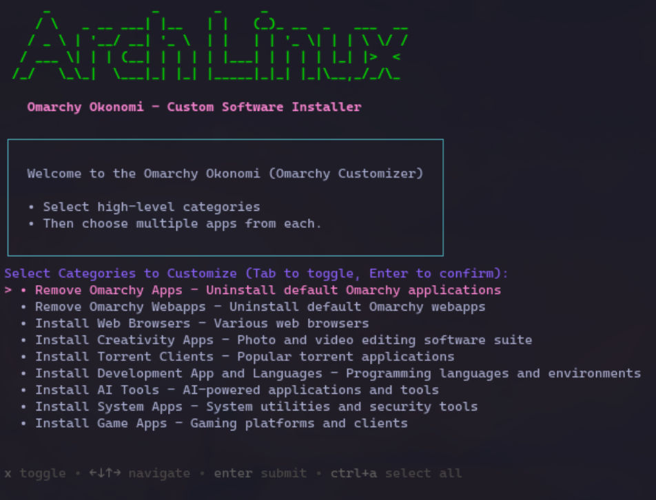

# Omarchy-Okonomi

### Purpose
The purpose of this repo is to add setup choices on top of Omarchy to fit your needs. Your choices should be applied to a fresh, upgraded base install of Omarchy.

Omarchy is based on the concept of "Opinionated Arch Linux", taking inspiration from the Japanese word *Omakase* (お任せ), meaning "I'll leave it up to you" or "Chef's choice".  
This repo flips that and starts with Omarchy, then adds some choice into the mix.  

*i.e.*, *Okonomi* (お好み), meaning "as you like" or "Customer's choice".  

Therefore, this is **Omarchy-Okonomi** ("Customer's choice" not "Chef's choice").

---



### Key Justifications
- I'm not a developer, so some of Omarchy's default applications I don't use day-to-day.
- I like the idea of installing a setup Arch system, but want my defaults applied post-install:
  - Removing apps I don't use.
  - Adding apps I do use.
  - Tweaking some keybindings.
  - Tweaking some configs.

### Instructions
1. Install Omarchy.
2. Perform a system update (using the built-in Omarchy update).
3. Clone this repo:  
   ```bash
   git clone https://github.com/nzkritik/omarchy-okonomi.git
   cd omarchy-okonomi
   ```
4. (Optional) Review the files and customize to suit your needs.
5. Run the install script:  
   ```bash
   ./install-all.sh
   ```
6. Select the options you want and let the system install them for you.
7. Reboot your system and enjoy! 🚀

### Completed List
-  Configure install script for more flexible options:
  -  Option to remove some Omarchy default apps.
      - Uses the built-in Omarchy app removal script.
  -  Option to remove some Omarchy default web apps.
      - Uses the built-in Omarchy web app removal script.
  -  Web Browsers.
      -  Brave - privacy-focused.
      -  Firefox - general purpose.
      -  Opera - feature-rich.
      -  Zen Browser - privacy-focused.
      -  Tor Browser - anonymity-focused.
  -  Creativity Apps.
      -  audacity - audio editing.
      -  blender - 3D modeling/animation.
      -  darktable - photo editing.
      -  davinci-resolve - video editing/color grading.
      -  digikam - photo management.
      -  displaycal - monitor calibration.
      -  gimp - image editing.
      -  inkscape - vector graphics.
      -  krita - digital painting.
      -  rapid-photo downloader - photo downloading. 
      -  scribus - desktop publishing.
      -  winff - video converter.
  -  Torrent Apps.
      -  deluge - lightweight.
      -  qBittorrent - feature-rich.
      -  rtorrent - command-line based.
      -  tixati - advanced features.
      -  Transmission - simple and easy to use.
  -  Development Apps.
      - anaconda - python version management.
      - android-studio - mobile app development.
      - dev-lang (ruby, python, nodejs, etc) installers.
      - intelliJ-IDEA-community - general purpose IDE.
      - postman - API development.
      - pycharm-community - python IDE.
      - sublime-text - lightweight text editor.
      - visual-studio-code - general purpose code editor.
      - waydroid - android environment.
  -  AI Tools.
      - ai-toolkit framework - general AI utilities.
      - automatic1111-webui - stable diffusion web UI.
      - clara-verse - multimodal AI model.
      - comfyUI - node-based stable diffusion UI.
      - fluxGym - LORA training tool.
      - lmstudio - local LLM interface.
      - ollama - local LLM management.
      - openwebui - Local LLM & AI web UI.
      - upscayl - AI image upscaler.
  -  Gaming Apps.
      -  steam - general gaming platform.
      -  lutris - game management.
      -  heroic-games-launcher - epic games launcher.
      -  itchio.io - indie games platform.
  -  System Tools/Security/Utilities.
      - amdgpu top monitor - GPU monitoring.
      - bitwarden - password manager.
      - bleachbit - system cleaner.
      - cmatrix - terminal matrix effect.
      - encrytfs - file encryption.
      - gocryptfs - file encryption.
      - kvm - virtualization.
      - neomatrix - terminal matrix effect.
      - nvtop - NVIDIA GPU monitoring.
      - p7zip-gui - file archiver GUI.
      - screensaver installer - various screensavers.
      - stow - dotfile manager.
      - tmux - terminal multiplexer.
      - sysc-walls - text based wallpaper.
      - veracrypt - disk encryption.
-  Provide options to install only certain categories of apps/configs.
-  Structure the install flow for minimal changes or highly tweaked installs.

### Todo List (future)
- Add System Tweaks section
- Add additional Omarchy customizations 
  - Deeper customizations (swapping core apps, even hyprland itself??).
- Add more custom apps/configs as I discover them.
- Improve testing to ensure installations don't break.

### References
- The great work by DHH and the team on [Omarchy](https://omarchy.org) ([GitHub repo](https://github.com/basecamp/omarchy)).
- This config is based on [typecraft's](https://typecraft.dev/) customizations ([GitHub repo](https://github.com/typecraft-dev/omarchy-supplement)).

---

### Disclaimer
This is a work in progress that I'm developing gradually while learning Git and other Linux tools.

---